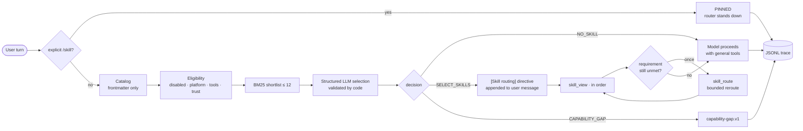

<div align="center">

# 🧭 Hermes Meta-Skill Router

**Dynamic skill discovery, semantic routing, composition, supervision, and capability-gap detection for [Hermes Agent](https://github.com/NousResearch/hermes-agent).**

[](https://github.com/swami8791/hermes-meta-skill-router/actions/workflows/tests.yml)


*Pick the fewest trusted skills that cover a request. Load only those. Reroute once. Trace everything.*

</div>

---

## Why

Hermes ships with dozens of skills and tells the model to "err on the side of loading". Every extra
`SKILL.md` in context costs tokens, and skill choice is invisible after the fact. The router adds a
deterministic layer between **user intent** and **skill execution**:

- 🔍 **Discovers** every installed skill from its frontmatter (profile, project, external, and plugin skills). Never reads a skill body.
- 🎯 **Selects** with BM25 retrieval plus one structured LLM call, then validates the answer in code: only shortlisted names, capped count, fail-open to *no skill*.
- 🛡️ **Supervises** loading through Hermes' own `skill_view`: optional gating of unselected loads, one bounded reroute per turn, explicit `/skill` invocations always win.
- 📜 **Traces** each decision as redacted JSONL so you can see what was considered, why it was rejected, and what actually got loaded.

It is a **plugin**. Hermes core is untouched, the system prompt stays byte-stable, and the default
mode adds zero bytes to any prompt.

## How it works



Integration seams (all sanctioned plugin hooks): `pre_llm_call` for the decision, `pre_tool_call` for
gating, `post_tool_call` for load observation, `on_session_end` for turn close, plus the `skill_route`
tool and the `/route` command. Details and evidence: [`docs/meta-skill-router-integration-plan.md`](docs/meta-skill-router-integration-plan.md).

## Quick start

```bash
git clone https://github.com/swami8791/hermes-meta-skill-router
cd hermes-meta-skill-router
make install            # copies plugin/meta-skill-router -> ~/.hermes/plugins/meta-skill-router
```

Enable it in `~/.hermes/config.yaml`:

```yaml
plugins:
  enabled: [meta-skill-router]
  entries:
    meta-skill-router:
      settings:
        mode: shadow          # shadow | advisory | active
```

Then use Hermes normally and inspect what the router would have done:

```text
/route dry-run find recent arxiv papers on sparse attention and save a note
/route stats
/route catalog
```

Set `HERMES_HOME` if you use a non-default profile; `make install` honours it.

## Modes

| Mode | Prompt bytes added | `skill_view` gating | When to use |
|---|---|---|---|
| `shadow` *(default)* | 0 | none | Collect traces. Compare the router's picks with what the model loaded unaided. |
| `advisory` | directive for `SELECT_SKILLS` / `CAPABILITY_GAP` | none | Prove the model follows routing; measure unselected loads. |
| `active` | directive, plus one line for `NO_SKILL` | blocks unselected loads beyond the reroute budget | Enforce "load only what was selected". |

Move up one mode at a time, with trace evidence. `/route stats` shows decision counts, loads, and
unselected loads.

## Configuration

All settings live under `plugins.entries.meta-skill-router.settings`:

| Setting | Default | Meaning |
|---|---|---|
| `mode` | `shadow` | see above |
| `max_candidates` | `12` | shortlist size handed to the selector |
| `max_selected` | `3` | skills one decision may select |
| `max_skills_per_turn` | `5` | total loads allowed per turn (matches Hermes' stacked-skill cap) |
| `max_reroutes_per_turn` | `1` | `skill_route` calls honoured per turn |
| `skip_platforms` | `[subagent]` | sessions the router ignores |
| `min_message_chars` | `12` | shorter messages are not routed |
| `selection_timeout_s` | `8` | selector timeout; on expiry the decision is `NO_SKILL` |
| `directive_max_chars` | `1500` | hard cap on the injected directive |
| `trace_enabled` / `trace_max_bytes` | `true` / 5 MiB | per-session JSONL trace and its trim size |
| `protocol_section` | `false` | register a static after-memory prompt note describing the protocol |
| `allow_untrusted` | `false` | let untrusted skills reach the selector |

The selector runs through the auxiliary task `meta_skill_router`, so a cheaper model can be pinned
under `auxiliary.meta_skill_router` in `config.yaml`.

## Repository layout

```text
.
├── plugin/meta-skill-router/     the Hermes plugin (copy this directory to ~/.hermes/plugins/)
│   ├── plugin.yaml               manifest: hooks, tool, settings schema
│   ├── __init__.py               register(ctx)
│   ├── router/                   catalog · manifest · eligibility · retrieval · selector · engine · hooks · trace · state
│   └── README.md                 operator guide
├── SKILL.md                      the meta-skill: operating policy for any host that loads skills
├── skill.manifest.yaml           optional overlay format (see references/contracts.md)
├── docs/
│   └── meta-skill-router-integration-plan.md   current-state map of Hermes, gap analysis, MVP, acceptance criteria
├── references/                   architecture · contracts · hermes-integration · testing
├── tests/                        pytest suite + synthetic skill fixtures
└── .github/workflows/tests.yml   CI against the pinned hermes-agent commit
```

## Guarantees

- **Fail-open.** Any router error, selector timeout, or malformed JSON yields `NO_SKILL`; the turn proceeds as if the plugin were absent.
- **Metadata only.** The router reads at most the frontmatter head of each `SKILL.md`, never calls `skill_view` itself, never installs skills, never widens permissions.
- **Cache-safe.** The system prompt is never modified; the directive rides the user message and is byte-stable for a given decision.
- **Bounded.** ≤ 12 candidates, ≤ 3 selections, ≤ 5 loads and exactly 1 reroute per turn by default.
- **Auditable.** Every decision, rejection, load, block, and reroute is one trace record, with secrets redacted by Hermes' own redaction.

## Development

```bash
export HERMES_AGENT_SRC=/path/to/hermes-agent   # checkout of NousResearch/hermes-agent @ 2332a64
make test                                        # 70 tests, ~10 s
```

CI clones hermes-agent at the pinned commit, installs it with `uv sync --frozen --extra dev`, and
runs the same suite. Bump the pin in `.github/workflows/tests.yml` and the badge above together.

## Status and roadmap

**MVP (this repo):** dynamic discovery · metadata-only retrieval · structured selection · deferred loading via `skill_view` · no / one / multi-skill decisions · one bounded reroute · structured traces · golden tests.

**Next:**
- Shadow-mode measurement on real sessions (top-1 accuracy, unselected-load rate, selector latency and cost).
- Upstream proposal: additive `available_tools` field in Hermes' `pre_llm_call` payload (exact eligibility instead of the platform approximation).
- V2: embedding retrieval, typed artifact contracts via `delegate_task.output_schema`, parallel composition, reliability signals.

See [`references/architecture.md`](references/architecture.md) and the plan's *Unresolved decisions* section.

## Contributing

Issues and PRs welcome. Read [`CONTRIBUTING.md`](CONTRIBUTING.md) first: the plugin follows Hermes'
contribution rules (plugins never touch core, prompt caching is sacred, tests assert behaviour
contracts, no new dependencies).

## License

Not yet declared for this repository. See [`CHANGELOG.md`](CHANGELOG.md) for release notes.
