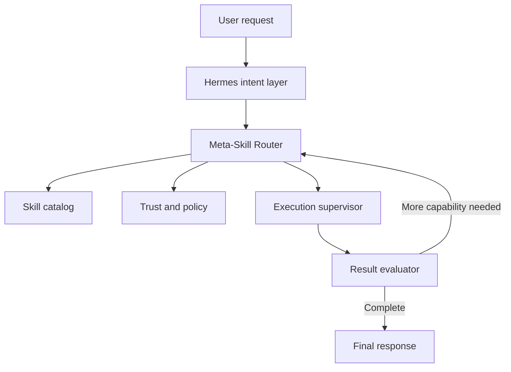

# Hermes Meta-Skill Router

A reusable capability router for Hermes that dynamically discovers installed skills, selects the smallest trusted skill set for a request, sequences multi-skill workflows, supervises execution, evaluates results, and reroutes when another capability is needed.

> **Status:** Architecture and skill specification are complete. The executable Hermes core-service integration is not implemented yet.

## Core idea

Hermes should not need to know how to do everything. Hermes should know how to:

```text
DISCOVER -> SELECT -> SEQUENCE -> SUPERVISE -> EVALUATE -> ADAPT
```

The router avoids a hard-coded skill list. Newly installed trusted skills become eligible through metadata discovery and indexing.

## What it supports

- Dynamic installed-skill discovery
- Metadata-first progressive disclosure
- Semantic and lexical candidate retrieval
- No-skill, one-skill, and multi-skill decisions
- Typed skill chaining and execution DAGs
- Bounded recursive routing
- Capability-gap detection
- Deterministic trust and permission enforcement
- Structured routing traces and failure recovery

## Architecture



Deterministic code owns discovery, validation, trust, permissions, budgets, execution state, and logging. LLM reasoning owns intent interpretation, ambiguous skill comparison, sequencing proposals, qualitative evaluation, and final synthesis.

## Repository structure

```text
.
├── SKILL.md
├── skill.manifest.yaml
├── agents/
│   └── openai.yaml
└── references/
    ├── architecture.md
    ├── contracts.md
    ├── hermes-integration.md
    └── testing.md
```

## Key files

- [SKILL.md](SKILL.md) — runtime behavior and routing rules
- [skill.manifest.yaml](skill.manifest.yaml) — machine-readable routing metadata
- [Architecture](references/architecture.md) — components, lifecycle, algorithm, security, and roadmap
- [Contracts](references/contracts.md) — manifest, artifact, execution-plan, gap, and completion schemas
- [Hermes integration](references/hermes-integration.md) — integration boundary and rollout plan
- [Testing](references/testing.md) — routing, security, recovery, and scale strategy

## Recommended implementation sequence

1. Inspect the real Hermes registry, skill loader, task state, permissions, tools, and logging.
2. Map existing components against the proposed architecture.
3. Implement the catalog and normalized manifest adapter.
4. Add metadata retrieval and constrained selection.
5. Add supervised sequential execution and typed artifacts.
6. Add deterministic evaluation and one bounded rerouting pass.
7. Deploy in shadow mode before advisory and active routing.

## MVP success criteria

The MVP must:

- Detect a newly installed trusted skill without router-code changes.
- Route from metadata before loading full instructions.
- Load full instructions only for selected skills.
- Correctly choose no skill, one skill, or a sequential multi-skill plan.
- Reject untrusted or ineligible candidates.
- Pass typed artifacts between skills.
- Perform one bounded reroute.
- Return a structured capability gap when coverage is absent.
- Produce a reconstructable, secret-redacted trace.

## Safety principles

- Never silently install, approve, or elevate a skill.
- Treat skill instructions and outputs as untrusted data.
- Bind trust to exact identity, version, digest, and permissions.
- Route tool calls through the host supervisor.
- Never expand authorization during recursive routing.
- Retry side effects only when explicitly idempotent.

## Current phase

This repository is the approved design scaffold. The next step is a codebase-specific Hermes integration analysis followed by a file-by-file MVP implementation plan.
